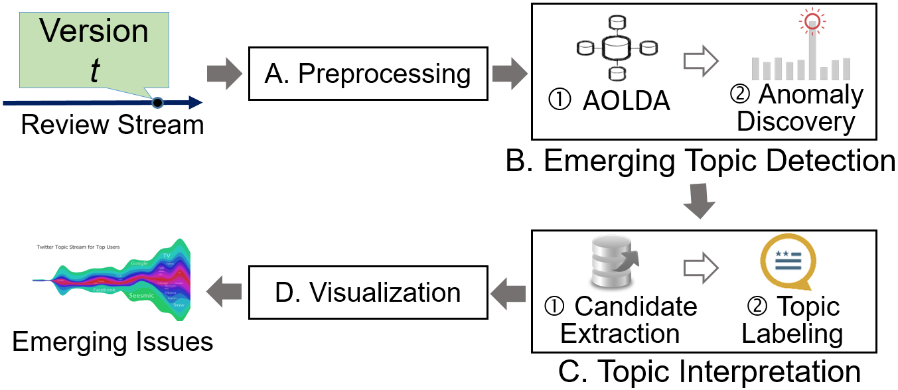

# IDEA
IDEA (IDentifying Emerging issues from App reviews) is a framework for detecting emerging issues from version-sensitive app reviews. You can view the [visualized demo](https://remine-lab.github.io/paper/idea_icse_18.html#home) with the output of IDEA on Youtube dataset.

<p align="center"></p>

IDEA employs a novel method AOLDA (Adaptively Online Latent Dirichlet Allocation) to model version-sensitive topic distributions. The emerging topics are then identified based on anomaly detection algorithm. IDEA labels each topic with the most relevant phrases and sentences based on an effective ranking scheme considering both semantic relevance and user sentiment. More details can be referred to the following paper: 

> Cuiyun Gao, Jichuan Zeng, Michael Lyu, Irwin King. Online App Review Analysis for Identifying Emerging Issues. ICSE 2018.


## Input Data Format
Input raw reviews should be saved as the following format per line. The attributes are separated by `******`, and only the first five attributes are necessary. The number of attributes should be claimed in the variable `InfoNum` under the `[Info]` section. Here, `InfoNum=6`.

```
rating******review text******title******date******version******nation
```

## Usage
1. Install python dependence packages for IDEA:

```
$ cd IDEA/
$ ./install.sh
```
IDEA is built on Python2.7 under Linux or iOS, add `sudo` before the installation command if you need administrator permission.

2. **Notice:** If this is the first time to use IDEA in your computer, you need to compile pyx and c. Also make sure `_lda.c` and `_lda.so` have been deleted before running the command:

```
$ cd src/
$ python build_pyx.py build_ext --inplace
```

3. Run the main program using sample data. This may take several minutes.

```
$ python main.py
```

One can modify the parameters for the inputs and outputs in `config.ini` easily. The outputs will be stored in `result/`.

## Dataset in the Paper
Researchers interested in obtaining the the full dataset (including the validation files) used in the paper may submit a [data request form](https://goo.gl/forms/nAAkSa5o5yrSIaPr2) to be provided with the data usage agreement and further information on obtaining the data.


## Visualization
1. The source code for visualization is under the folder `visualization`. To prepare the input for visualization, we first run

```
$ python get_input <result_folder> <topic_number>

result_folder ----- the output dir of IDEA, should contain apk name, e.g., '../result/youtube/'
topic_nubmer  ----- the number of topics
```

2. Use localhost server to display the topic river. For Python 2, run `$ python -m SimpleHTTPServer 7778`, while for Python 3, run `python -m http.server 7778`. `7778` is the port number for viewing the visualization, e.g., for localhost, here we type `localhost:7778` in the browser.

**For Linux or iOS:**, can simply run:

```
$ bash visualize.sh <result_folder> <K>
```

## Validation
1. Download the word2vec model trained on 4 millions app reviews from this [link](https://www.dropbox.com/s/et4n6sj3k94ku2s/wv.zip?dl=0), and unzip the directory in the `model` folder.

2. Change the value of `Validate` in `config.ini` to be `1`, and run the script.

```
$ python main.py
```

## Citation

Please cite the ICSE paper if you use IDEA / datasets / trained word2vec in your work:
```
@inproceedings{gao2018online,
    title={Online App Review Analysis for Identifying Emerging Issues},
    author={Cuiyun Gao and Jichuan Zeng and Michael R. Lyu and Irwin King},
    booktitle={Proceedings of the 40th International Conference on Software Engineering, {ICSE} 2018},
    year={2018}
}
```
## Related Link
* [ReMine-Lab](https://remine-lab.github.io/), you can see our other work.

## History
2018-2-4: first version of IDEA
